<div align="center">

# 🌊 Swale & Trench Placement Tool

### Intelligent Terrain Analysis for Optimal Water Management

[](https://python.org)
[](https://streamlit.io)
[](LICENSE)

_Transform raw terrain data into actionable water management insights with interactive visualizations and intelligent classification._

</div>

---

## 📸 Screenshots

<div align="center">

### Interactive Map View


### Contour Analysis


</div>

---

## ✨ Key Features

| Feature                         | Description                                                             |
| ------------------------------- | ----------------------------------------------------------------------- |
| 🗺️ **Multi-Coordinate Support** | Auto-detect UTM/Lat-Lon, custom EPSG codes, smart coordinate validation |
| 📊 **Interactive Contour Maps** | Zoomable, pannable Plotly contours with customizable color schemes      |
| 🎯 **Smart Classification**     | KMeans-based terrain classification into Swales and Trenches            |
| 📈 **Statistics Dashboard**     | Total points, elevation range, terrain distribution at a glance         |
| 💾 **Export Options**           | CSV data, TXT summary, professional PDF reports                         |
| 🌙 **Dark/Light Mode**          | Toggle between themes for comfortable viewing                           |

---

## 🚀 Quick Start

### Prerequisites

- Python 3.8 or higher
- pip package manager

### Installation

```bash
# Clone the repository
git clone https://github.com/puneet-chandna/water-brakes.git
cd water-brakes

# Create virtual environment (recommended)
python -m venv myenv
source myenv/bin/activate  # On Windows: myenv\Scripts\activate

# Install dependencies
pip install -r requirements.txt
```

### Running the App

```bash
streamlit run app.py
```

The app will open in your browser at `http://localhost:8501`

---

## 📁 Project Structure

```
water-brakes/
├── 📄 app.py                 # Main Streamlit application
├── 📄 model.py               # Data processing & ML logic
├── 📂 utils/
│   ├── coordinates.py        # CRS detection & transformation
│   ├── visualization.py      # Chart creation utilities
│   └── export.py             # PDF & report generation
├── 📂 assets/                # Screenshots & branding
├── 📄 requirements.txt       # Python dependencies
├── 📄 sampledata.csv         # Example terrain data
└── 📄 README.md
```

---

## 📋 Data Format

Your CSV file should contain the following columns:

| Column         | Type  | Description                     |
| -------------- | ----- | ------------------------------- |
| `Easting`      | Float | UTM X coordinate (meters)       |
| `Northing`     | Float | UTM Y coordinate (meters)       |
| `Elevation`    | Float | Height above sea level (meters) |
| `Distance (m)` | Float | Distance from origin (optional) |

**OR** for Lat/Lon data:

| Column      | Type  | Description                     |
| ----------- | ----- | ------------------------------- |
| `Latitude`  | Float | Decimal degrees (-90 to 90)     |
| `Longitude` | Float | Decimal degrees (-180 to 180)   |
| `Elevation` | Float | Height above sea level (meters) |

---

## 🎨 Themes

<div align="center">

|           Light Mode            |           Dark Mode           |
| :-----------------------------: | :---------------------------: |
|  |  |

</div>

Toggle between themes using the 🎨 Theme switch in the sidebar.

---

## 🔬 How It Works

```mermaid
graph LR
    A[📄 Upload CSV] --> B[🔍 Detect CRS]
    B --> C[🔄 Transform Coords]
    C --> D[📐 Calculate Slopes]
    D --> E[🤖 KMeans Clustering]
    E --> F[🗺️ Visualize Results]
```



1. **Data Upload** - Upload your terrain CSV data
2. **Coordinate Detection** - Auto-detect UTM or Lat/Lon format
3. **Transformation** - Convert to WGS84 for mapping
4. **Analysis** - Calculate slopes and apply KMeans clustering
5. **Classification** - Identify Swales (low areas) and Trenches (high areas)
6. **Visualization** - Interactive maps and contour plots

---

## 📊 Understanding Results

| Classification | Color    | Description                                             |
| -------------- | -------- | ------------------------------------------------------- |
| **Swale**      | 🟢 Green | Lower elevation areas - ideal for water collection      |
| **Trench**     | 🔵 Blue  | Higher elevation areas - suitable for drainage channels |

---

## 📦 Dependencies

| Package        | Purpose                    |
| -------------- | -------------------------- |
| `streamlit`    | Web application framework  |
| `pandas`       | Data manipulation          |
| `plotly`       | Interactive visualizations |
| `matplotlib`   | Static plotting            |
| `scikit-learn` | KMeans clustering          |
| `pyproj`       | Coordinate transformations |
| `scipy`        | Contour interpolation      |
| `reportlab`    | PDF report generation      |

---

## 🤝 Contributing

Contributions are welcome! Please feel free to submit a Pull Request.

1. Fork the repository
2. Create your feature branch (`git checkout -b feature/AmazingFeature`)
3. Commit your changes (`git commit -m 'Add some AmazingFeature'`)
4. Push to the branch (`git push origin feature/AmazingFeature`)
5. Open a Pull Request

---

## 📄 License

This project is licensed under the **MIT License** - see the [LICENSE](LICENSE) file for details.

---

<div align="center">

**Built with ❤️ for sustainable water management**

[⬆ Back to Top](#-swale--trench-placement-tool)

</div>
